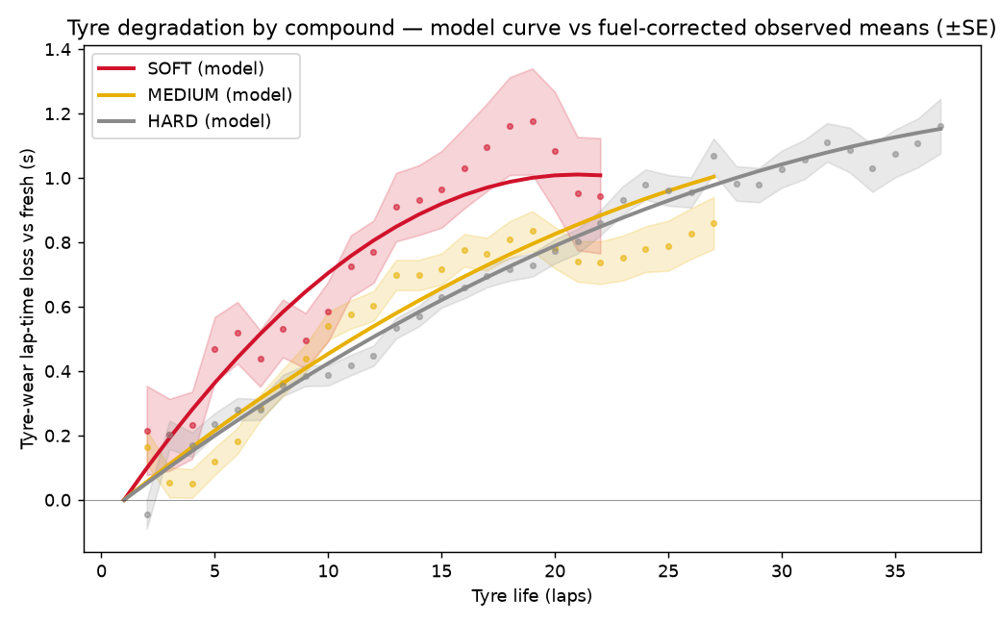
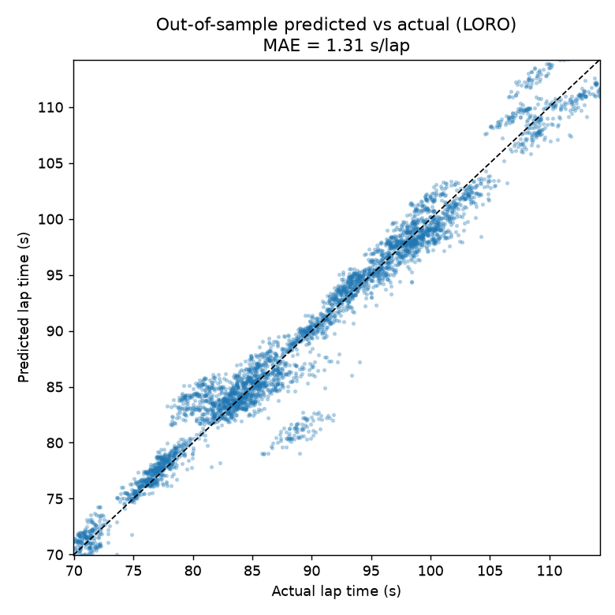
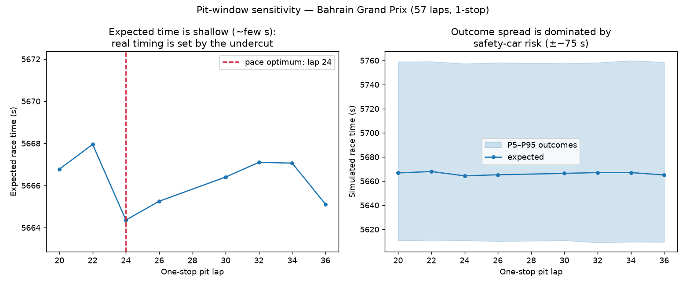

# PitWall — F1 tyre-degradation modelling & pit-strategy simulation

**Question:** given three seasons of real Formula 1 race data, can we (a) estimate how
each tyre compound degrades once fuel and circuit effects are stripped out, and (b) use
that model to choose a pit-stop strategy — and how does that strategy compare to what the
teams actually did?

Everything below is measured by running the code in this repo. There are no illustrative
or placeholder numbers; re-running the pipeline reproduces every figure in this README.

## Data

- **Source:** [FastF1](https://docs.fastf1.dev/), race sessions only.
- **Scope:** **3 full seasons (2022, 2023, 2024) — 68 races, 0 ingestion failures.**
- Ingestion is resumable and rate-limit-aware (`scripts/ingest.py`): each race is a
  separate parquet, failures are logged and retried, and a manifest records exactly what
  landed.

## Tier 1 — Clean lap dataset

Each exclusion rule is a separately tested function (`src/pitwall/clean.py`), applied in
order. Rules that need a stint context (outliers, short stints) run last. Wet/mixed-
condition races are dropped entirely so the degradation model owns a clean dry-tyre
problem.

**74,601 raw laps → 53,854 valid laps across 2,824 stints (59 of 68 races retain dry-race data).**

| rule | removed | remaining |
| --- | --- | --- |
| null_laptime | 1187 | 73414 |
| null_tyrelife | 543 | 72871 |
| lap_1 | 1324 | 71547 |
| pit_in_out_laps | 4406 | 67141 |
| non_green_track_status | 5223 | 61918 |
| mixed_condition_race | 7536 | 54382 |
| wet_intermediate_laps | 0 | 54382 |
| unknown_compound | 26 | 54356 |
| stint_median_outlier_7pct | 91 | 54265 |
| short_stint_lt5 | 411 | 53854 |

(`wet_intermediate_laps` removes 0 because `mixed_condition_race` already drops every
wet-affected race in full — the two rules are kept separate so each is auditable.)

## Tier 2 — Degradation model

Lap time is dominated by fuel and circuit, not tyre wear, so both are removed before
degradation is estimated:

- **Circuit** — absorbed by centering lap time on the per-circuit mean (a circuit fixed
  intercept). This also makes cross-validation robust: a held-out race's circuit intercept
  comes from the *other* season's running of that circuit.
- **Fuel / track evolution** — `race_progress` (lap ÷ race length) as a linear fixed effect.
- **Season** — a fixed effect for the annual car/regulation pace step.
- **Tyre wear** — compound-specific **linear + quadratic** `tyre_life` terms, so each
  compound gets its own degradation curve.
- **Driver** — a random intercept grouped by driver-season (`statsmodels` **MixedLM**).

The MixedLM **converged on the full dataset and on all cross-validation folds**; the
documented fallback (OLS with driver fixed effects) was not needed.

**Baseline** (the comparison number): per-compound OLS of lap time on `tyre_life`, with no
circuit, fuel, or quadratic term.

**Validation:** leave-one-race-out over the 21 circuits with cross-season data (the
held-out race is never in training). Error is mean absolute lap-time error in seconds.

| | Model (MixedLM) | Baseline (per-compound OLS) |
| --- | --- | --- |
| **CV MAE (s/lap)** | **1.31** | 9.06 |
| SOFT | 1.91 | 9.28 |
| MEDIUM | 1.35 | 8.99 |
| HARD | 1.14 | 9.06 |

**The model cuts out-of-sample lap-time error by 85.5% vs the baseline** (1.31 vs 9.06
s/lap), evaluated on 55 held-out races. It is weakest on SOFT (1.91 s/lap) — softs run
short, aggressive stints and are the most variable compound.




## Tier 3 — Monte-Carlo strategy simulator

For a race (circuit, laps, compounds) and a stint plan, race time is a deterministic
degradation sum plus stochastic draws — all estimated from the data, none hardcoded:

- **pit-lane loss** — per-circuit empirical pool from real in/out-lap deltas (≈19–28 s).
- **safety car** — Bernoulli occurrence at the per-circuit historical rate, start lap from
  the circuit's historical SC-lap pool; SC laps cost time and a stop taken in the SC window
  is discounted (the "cheap stop").
- **lap-time noise** — from the fitted model's residual spread (σ ≈ 1.46 s/lap).

Physical tyre life is capped per compound at the 90th-percentile stint actually run
(SOFT 22, MEDIUM 27, HARD 37 laps), so the optimiser can't "run" an impossible stint. It
enumerates one- and two-stop plans over a pit-lap grid (2,000 sims each) and returns the
plan with the lowest expected race time and its P5–P95 band.



### Backtest vs the field (59 races)

Agreement is defined up front as **same stop count *and* every pit lap within ±3 laps** of
the field's median strategy. The simulator never sees the actual pit laps.

- **Stop-count agreement: 49.2%** — the simulator picks the right number of stops about
  half the time.
- **Strict (stop count + pit laps ±3) agreement: 6.8%.**
- **Mean pit-lap offset: +7.4 laps** — the simulator pits *later* than the teams.

That offset is the real result, not noise: the simulator finds the **pace-optimal** pit
window (near half-distance, where the degradation cost of the two stints balances), while
real teams pit ~7–8 laps earlier to execute **undercuts** and defend track position — a
dynamic a pace-only model does not contain. The pit-window figure shows why exact-lap
agreement is low: the expected-time surface is shallow (a few seconds across a wide
window), so real decisions are driven by track position, not lap-time pace. (A backtest
agreement above ~90% here would indicate the actual pit laps had leaked into the model;
they have not.)

## Limitations (read before trusting a number)

- **No undercut / track-position model.** The simulator optimises pure race pace, so it
  systematically pits later than reality (+7.4 laps). This is the single biggest gap.
- **No traffic model** — clean-air pace only; the ~7% stint-median outlier filter removes
  most traffic-affected laps but also trims genuine end-of-stint "cliff" laps, so the fitted
  degradation is closer to linear than the real nonlinear cliff.
- **Dry races only** — wet/intermediate laps and mixed-condition races are excluded.
- **Degradation is per-compound, not per-driver** (drivers enter only as a random
  intercept, not as random slopes).
- **Simplified safety-car model** — fixed duration and slowdown factor; SC rates at some
  circuits rest on only 2–3 races.

## Reproduce

```bash
pip install -e ".[dev]"
python scripts/ingest.py          # 3 seasons -> data/raw/*.parquet (resumable; rate-limited)
python scripts/build_clean.py     # Tier 1 -> data/laps_clean.parquet + exclusion table
python scripts/fit_model.py       # Tier 2 -> LORO CV, results/model_metrics.json
python scripts/backtest.py        # Tier 3 -> results/backtest.json
python scripts/make_figures.py    # figures/*.png
pytest -q                         # 17 tests
```

`data/laps_clean.parquet` and `results/` are committed, so Tiers 2–4 reproduce without
re-ingesting.

## Tests (17, run in CI on every push)

One test per exclusion rule, a degradation-monotonicity test (predicted lap time rises with
tyre life within a compound), a circuit-offset recovery test, simulator sanity tests (zero
degradation + real pit loss ⇒ fewest stops; strong wear + free stops ⇒ more stops; ordered
percentile band), and a regression test pinning the clean-lap count.

## Layout

```
src/pitwall/   clean.py · model.py · simulate.py · config.py
scripts/       ingest.py · build_clean.py · fit_model.py · backtest.py · make_figures.py
tests/         test_clean.py · test_model.py · test_simulate.py
results/       metrics JSON, exclusion table, backtest table (committed)
figures/       the three PNGs above
```
